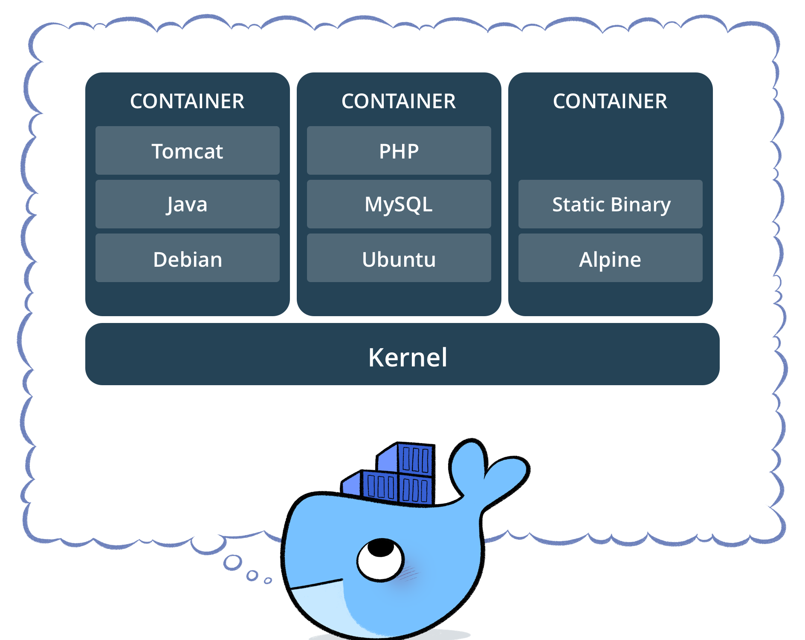

- title : Docker Workshop
- description : Docker Workshop
- author : Krystian Kolad
- theme : night
- transition : default

***

## Docker Workshop

 

***

## Czym jest docker?

---

## Konteneryzacja

* lekkie, odosobnione części systemu
* łatwo zarządzalne
* ujednolicenie środowisk dev/test/prod
* możliwość integracji usług niezależnie od języka
* szybkie przywracanie kontenera po awarii

---

## Kontener a wirtualka

 

***

## Wykorzystania dockera

---

## "Mała wirtualka"

* lżejsze, niż zwykła wirtualka
* z poziomu linii komend można zrobić praktycznie wszystko
* łatwe w zarządzaniu

---

## Programy odpalane na dockerze

* brak potrzeby instalowania aplikacji lokalnie
* dobre do testowania narzędzi
* łatwo uruchomić, łatwo usunąć

---

## Mikroserwisy

* wszystkie serwisy odpalane w odosobnionych kontenerach
* łatwość zarządzania

***

## Przykładowe komendy

---

## Obrazy

* docker search
* docker pull
* docker images
* docker rmi

---

## Kontenery

* docker run
* docker ps
* docker stop/kill
* docker rm
* docker start

---

## Docker-compose

* docker-compose up
* docker-compose down

***

## Demo - "wirtualka" linuxa do kompilowania cpp

***

## Demo - aplikacja składająca się z kilku komponentów

***

## Pytania

*** 

## Dziękuję za uwagę